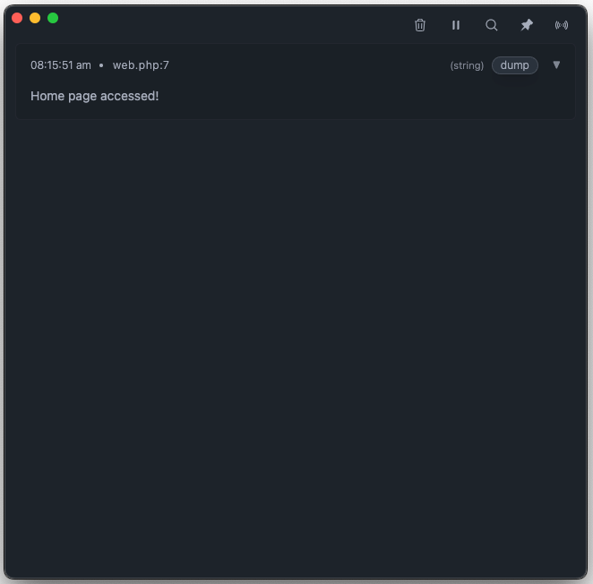
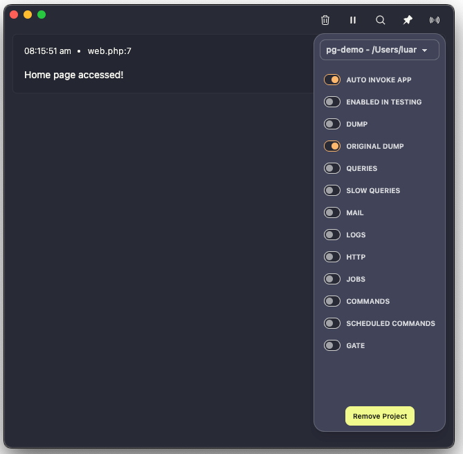
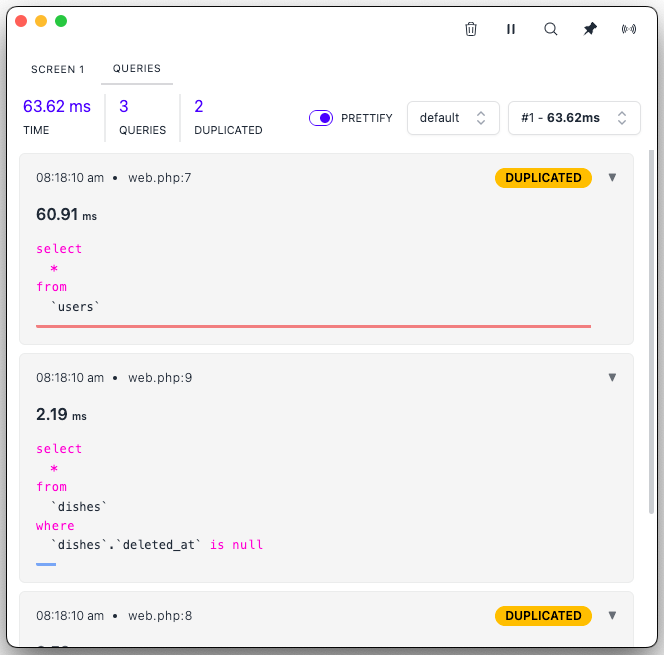

<p align="center">
  
</p>
<h1 align="center">LaraDumps</h1>
<div align="center">
  <h4><a href="https://laradumps.dev/get-started/installation.html" target="_blank">Download the App</a></h4>
  <sub>Available for Windows, Linux and macOS.</sub>
  <br />
  <br />
  <p>
    <a href="https://laradumps.dev"> 📚 Documentation </a>
  </p>
</div>
 <br/>
<div align="center">
  <p align="center">
    <a href="https://packagist.org/packages/laradumps/laradumps">
      
    </a>
    <a href="https://packagist.org/packages/laradumps/laradumps">
      
    </a>
    <a href="https://packagist.org/packages/laradumps/laradumps">
      
    </a>
    <a href="https://github.com/laradumps/laradumps/actions">
        
    </a>
    <a href="https://packagist.org/packages/laradumps/laradumps">
      
    </a>
  </p>
</div>

### 👋 Hello Dev,

<br/>

LaraDumps is a friendly app that boosts your [Laravel](https://larvel.com/) PHP coding and debugging experience.

When using LaraDumps, you can see the result of your debug displayed in a standalone Desktop application.

These are some debug tools available for you:

- [Dump](https://laradumps.dev/debug/usage.html#dump) single or multiple variables at once.
- Send `dump`, `dd` to LaraDumps app.
- Watch [Laravel Mail](https://laravel.com/docs/mail).
- See your dumped values in a [Table](https://laradumps.dev/debug/usage.html#table), with a built-in search feature.
- Improve your debugging experience using different [screens](https://laradumps.dev/debug/usage.html#screens).
- Watch [SQL Queries](hhttps://laradumps.dev/debug/usage.html#sql-queries).
- Watch Slow Queries [SQL Queries](hhttps://laradumps.dev/debug/usage.html#sql-queries).
- Monitor [Laravel Logs](https://laravel.com/docs/logging).
- Monitor [Livewire component](https://livewire.laravel.com).
- Validate [JSON strings](https://laradumps.dev/debug/usage.html#json).
- Verify if a string [contains](https://laradumps.dev/debug/usage.html#contains) a substring.
- View `phpinfo()` configuration.
- List your [Laravel Routes](https://laravel.com/docs/routing).
- Inspect [Model](https://laravel.com/docs/eloquent) attributes.
- Learn more in our [Reference Sheet](https://laradumps.dev/debug/reference-sheet.html).
- Multiple Themes (light, dark, dracula, dim, retro ...)
- Shortcuts (clear, always on top)

<br/>

### Get Started

#### Requirements

 PHP 8.1+ and Laravel 10.0+

#### Using Laravel
```shell
 composer require laradumps/laradumps --dev
 ```

#### PHP Project
```shell
 composer require laradumps/laradumps-core --dev
 ```

See also: https://laradumps.dev/get-started/release-notes.html#php-package

* Debug your code using `ds()` in the same way you would use Laravel's native functions dump() or dd().

* Run your Laravel application and see the debug dump in the LaraDumps App window.

### Example

Here's an example:

```php
// File: routes/web.php

<?php 

Route::get('/', function () {
    ds('Home page accessed!');
    return view('home');
});
```

The Desktop App receives:

<p align="center">
  
  
  
</p>

```php
// File: routes/web.php

<?php 

Route::get('/', function () {
    \App\Models\User::all(); // duplicate query example
    \App\Models\User::all(); // duplicate query example
    \App\Models\Dish::all();
    return '';
});
```

The Desktop App receives:

<p align="center">
  
</p>
### Credits

LaraDumps is a free open-source project, and it was inspired by [Spatie Ray](https://github.com/spatie/ray), check it out!

- Author: [Luan Freitas](https://github.com/luanfreitasdev)

- Logo by [Vitor S. Rodrigues](https://github.com/vs0uz4)
