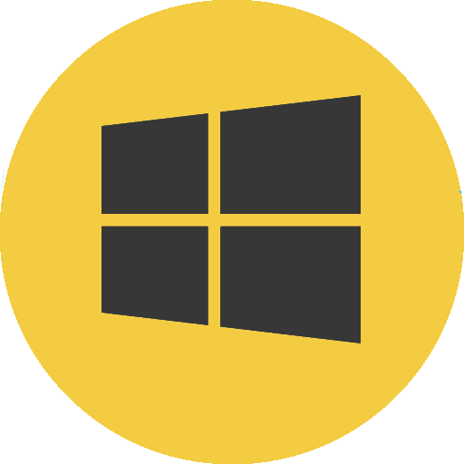
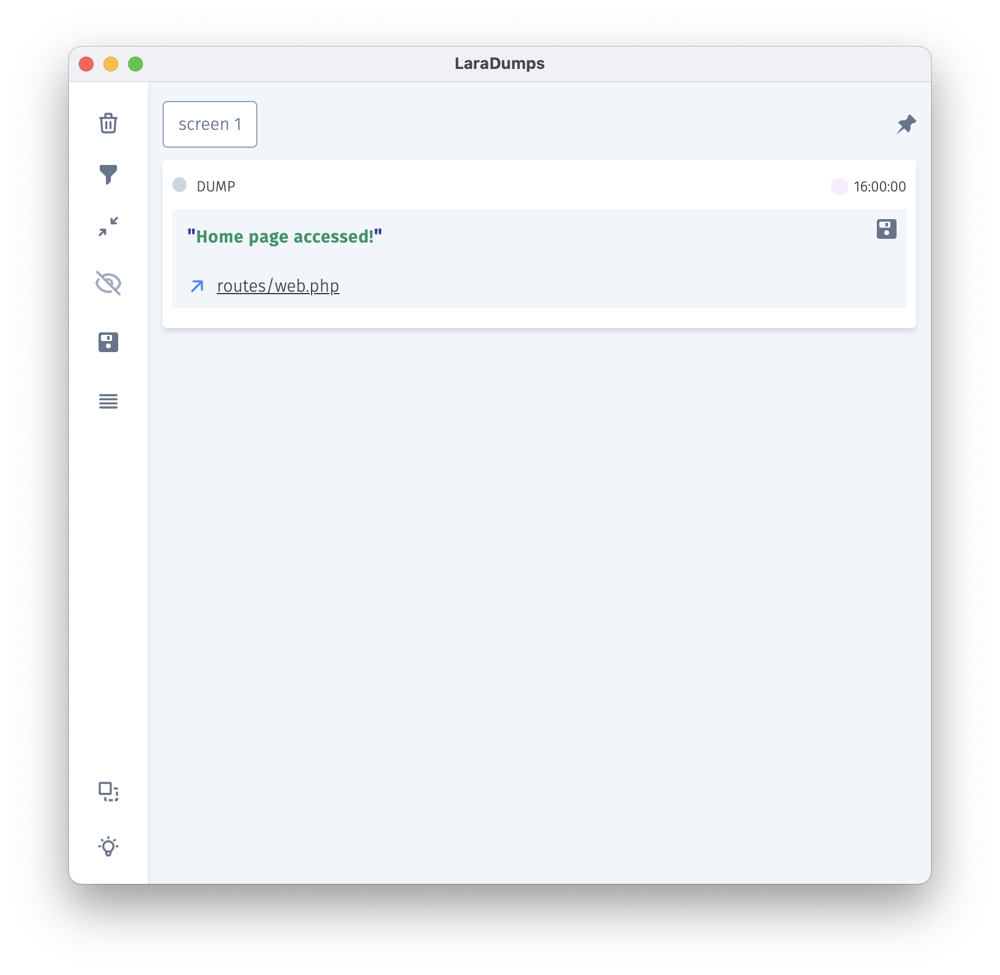

<p align="center">
  
</p>
<h1 align="center">LaraDumps</h1>
<div align="center">
  <br />
  <!--LaraDumpsVersion-->
  <p align="center">
    <a href="https://github.com/laradumps/app/releases/download/v2.0.2/LaraDumps-Setup-2.0.2.exe">
      
    </a>
    <a href="https://github.com/laradumps/app/releases/download/v2.0.2/LaraDumps-2.0.2-universal.dmg">
      
    </a>
    <a href="https://github.com/laradumps/app/releases/download/v2.0.2/LaraDumps-2.0.2.AppImage">
      
    </a>
  </p>
  <!--EndOfLaraDumpsVersion-->
  <h3>Click to Download the App</h3>
  <sub>Available for Windows, Linux and macOS.</sub>
  <br />
  <br />
  <p>
    <a href="https://laradumps.dev"> 📚 Documentation </a>
  </p>
</div>
 <br/>
<div align="center">
  <p align="center">
    <a href="https://packagist.org/packages/laradumps/laradumps">
      
    </a>
    <a href="https://packagist.org/packages/laradumps/laradumps">
      
    </a>
    <a href="https://packagist.org/packages/laradumps/laradumps">
      
    </a>
    <a href="https://github.com/laradumps/laradumps/actions">
        
    </a>
    <a href="https://packagist.org/packages/laradumps/laradumps">
      
    </a>
  </p>
</div>

### 👋 Hello Dev,

<br/>

LaraDumps is a friendly app designed to boost your [Laravel](https://larvel.com/) PHP coding and debugging experience.

When using LaraDumps, you can see the result of your debug displayed in a standalone Desktop application.

These are some debug tools available for you:

- [Dump](https://laradumps.dev/#/laravel/debug/usage?id=dump) single or multiple variables at once.
- See your dumped values in a [Table](https://laradumps.dev/#/laravel/debug/usage?id=table), with a built-in search feature.
- Improve your debugging experience using different [screens](https://laradumps.dev/#/laravel/debug/usage?id=screens).
- Watch [SQL Queries](https://laradumps.dev/#/laravel/debug/usage?id=sql-queries).
- Monitor [Laravel Logs](https://laravel.com/docs/9.x/logging).
- Validate [JSON strings](https://laradumps.dev/#/laravel/debug/usage?id=json).
- Compare strings with [diff](https://laradumps.dev/#/laravel/debug/usage?id=diff).
- Verify if a string [contains](https://laradumps.dev/#/laravel/debug/usage?id=contains) a substring.
- View `phpinfo()` configuration.
- Debug [Livewire](https://laravel-livewire.com) Components & Events.
- List your [Laravel Routes](https://laravel.com/docs/9.x/routing).
- Inspect [Model](https://laravel.com/docs/9.x/eloquent) attributes.
- Learn more in our [Reference Sheet](https://laradumps.dev/#/laravel/debug/reference-sheet).

<br/>
<table>
  <tr>
    <td>
      <p>🔥 Run <a href="https://laradumps.dev/#/laravel/debug/deploying-to-production" target="_blank">artisan ds:check()</a> in your CI Pipeline to make sure there is no <a href="https://laradumps.dev/#/laravel/debug/reference-sheet" target="_blank">ds()</a> shipped to Production.</p>
    </td>
  </tr>
</table>

<br>

### Get Started

#### Requirements

 PHP 8.0+ and Laravel 8.75+

#### Usage

1. Download the 🖥️ [LaraDumps](https://github.com/laradumps/app) Desktop App here: [LaraDumps Desktop App](https://laradumps.dev/get-started/installation.html#desktop-app)
2. Install LaraDumps in your Laravel project, run:

```shell
 composer require laradumps/laradumps --dev
 ```

3. Configure LaraDumps, run:

```shell
php artisan ds:init
 ```

4. Debug your code using `ds()` in the same way you would use Laravel's native functions dump() or dd().

5. Run your Laravel application and see the debug dump in LaraDumps App window.

### Example

Here's an example:

```php
// File: routes/web.php

<?php 

Route::get('/', function () {
    ds('Home page accessed!');
    return view('home');
});
```

The Desktop App receives:

<p align="center">
  
</p>

### Credits

LaraDumps is a free open-source project, and it was inspired by [Spatie Ray](https://github.com/spatie/ray), check it out!

- Author: [Luan Freitas](https://github.com/luanfreitasdev)

- Logo by [Vitor S. Rodrigues](https://github.com/vs0uz4)
